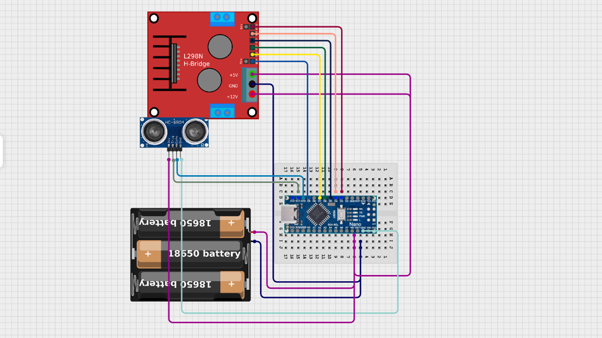

# Robot car workshop
*FORMLABS x ISEEQ x RESOLOON*

In this workshop we built a robot car, which can go, and turn around if it would hit a wall. It can be programmed to do more complicated tasks. The documentation of the project is written here plus in the presentation directory with my whole presentation. 

Feel free to build it at home even if you missed the workshop!

## BOM - bill of materials
You can find the BOM xml file in the repo, which contains everything you need to build the robot - all from [HEstore](https://www.hestore.hu/) (based in Hungary, ships to nearby countries). It doesn't contain the 3D printed base of the car.

| Quantity | Component | Description |
|----------|-----------|-------------|
| 1 | Battery holder | 3x AA battery holder with/without switch |
| 3 | AA batteries | LR6 alkaline batteries |
| 2 | DC motors | Standard DC hobby motors (RM-17) |
| 2 | Wheels | 66mm diameter wheels compatible with DC motors (RM-18-66) |
| 1 | Breadboard | 170-point or bigger solderless breadboard |
| 1 | L298N motor driver | Dual H-bridge motor driver module |
| 1 | Arduino Nano | Arduino Nano with FTDI chip |
| 1 | Jumper wire set | Male-to-male jumper wires for connections |
| 1 | Ultrasonic sensor | HC-SR04+ ultrasonic distance sensor | 
| 1 | 3rd wheel | D50mm H68mm torsion wheel | 
| 0 | SG-90 servo | extra servo motors to have fun | 

## CAD
The CAD design was done in Oneshape, which is a really great, browser based CAD software with all of the features you need for basic 3D modelling.

My design is available here: [Onshape link](https://cad.onshape.com/documents/c0c6b1d6464696af57e9dadc/w/3ff449f94ac21dbc34191623/e/c23118844ff9a8772e69ace6?renderMode=0&uiState=693702fb0922c10ba5e02668)

This model can be printed on basically every 3D printer, just make sure you have the right orientation of the model.

## Wiring

We were using an Arduino nano, but the project can be made using other controllers, such as Arduino Uno, or even ESP based dev boards. The ENA and ENB pins however should be connected to PWM (pulse with modulation) capable pinouts.

| Arduino pin | Connected |
|-----------|----------|
| D3 | L298N ENB (pwm) |
| D4 | L298N IN4 |
| D5 | L298N IN3 |
| D6 | L298N IN2 |
| D7 | L298N IN1 |
| D9 | L298N ENA (pwm)|
| D10 | HC-SR04 echo |
| D11 | HC-SR04 trig |
| 5V | Battery + |
| 5V | L298N +5V |
| 5V | L298N +12V |
| GND | Battery GND |
| GND | L298N GND |
| GND | HC-SR04 GND |
| 5V | HC-SR04 Vcc |

## Presentation

The presentation is available both in pdf and in pptx format in the docs directory. 